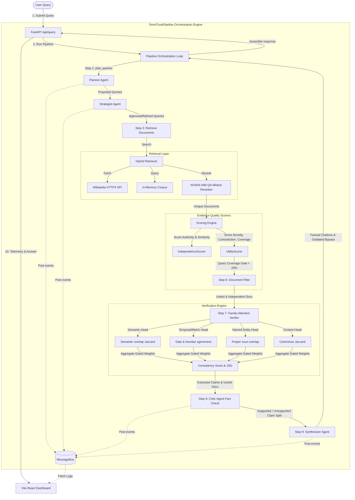

# OmniTrust-RAG 🛡️ — Multi-Agent RAG with Collaborative Verification

OmniTrust-RAG is a production-grade, multi-agent Retrieval-Augmented Generation (RAG) system coupled with a real-time evidence verification engine. By fusing three advanced architectural paradigms, it provides highly credible, fact-audited answers while minimizing hallucinations and retrieval contamination:
1. **Adaptive Evidence RAG:** Factual retrieval that evaluates evidence across source independence (via NLI/TF-IDF cosine similarity clustering) and information utility (novelty vs. contradiction).
2. **Pluto Multi-Agent Architecture:** Factual synthesis driven by an active Planner-Strategist agent council, with automatic Critic auditing and Synthesizer claim formatting.
3. **FamilyAttn Verification:** A local 4-head attention verifier analyzing divergence across Semantic, Named Entity, Temporal, and Context representations using Jensen-Shannon (JS) divergence.

The system is controlled via an **Obsidian Neo-Glow Developer Dashboard** built with React, Vite, and custom Vanilla CSS. It features an interactive horizontal pipeline progress track, consensus similarity heatmaps, and a Datadog-style JSON log viewer.

---

## 🏗️ Detailed System Architecture



---

## 📂 Project Structure

```
omnitrust-rag/
├── README.md                      # Core documentation (this file)
├── .gitignore                     # Root Git exclusions (build artifacts, env, node_modules)
├── backend/                       # Python FastAPI Backend
│   ├── main.py                    # Entrypoint (endpoints, CORS, SPA static file serving)
│   ├── requirements.txt           # Python backend dependencies
│   ├── test_pipeline.py           # Integration test script
│   ├── evaluate.py                # 10-question evaluation benchmark
│   └── omnitrust/
│       ├── bus.py                 # Thread-safe agent MessageBus
│       ├── config.py              # Global settings & API credentials
│       ├── agents.py              # LLM agent definitions (Planner, Strategist, Critic, Synthesizer)
│       ├── retriever.py           # Hybrid Wikipedia/Corpus retriever + NVIDIA NIM Reranking
│       ├── scorer.py              # Source Independence & Utility scorers
│       ├── family_verifier.py     # 4-head Family Attention verifier (JS Divergence)
│       └── pipeline.py            # 10-step orchestrator pipeline
└── frontend/                      # Vite + React Frontend
    ├── index.html                 # App shell (Plus Jakarta Sans & JetBrains Mono)
    ├── package.json               # Node dependencies
    ├── vite.config.js             # Vite configuration with API reverse proxy
    └── src/
        ├── main.jsx               # React main hook
        ├── api.js                 # API endpoints bindings
        ├── index.css              # Obsidian Neo-Glow style sheet
        └── App.jsx                # Responsive telemetry dashboard
```

---

## ⚡ Detailed 10-Step Orchestration Pipeline

When you submit a query, the backend executes the following loop:

### 1. Planning & Strategizing
* **Step 1: Planner Agent** – Formulates 3 to 5 diverse search queries using Groq (`llama-3.1-8b-instant`). Prompts are locked to avoid expanding topics tangentially.
* **Step 2: Strategist Agent** – Audits the queries using Groq (`llama-3.3-70b-versatile`) to verify relevance, rejecting queries that introduce topic drift.

### 2. Retrieval & Reranking
* **Step 3: Hybrid Retrieval** – Queries are sent in parallel to a local in-memory corpus and a native HTTPX Wikipedia client.
* **NVIDIA NIM Reranking** – Combines and reranks retrieved documents using the `rerank-qa-mistral-4b` model to prioritize high-relevance pages.

### 3. Evidence Quality Scoring
* **Step 4: Source Independence Scorer** – Calculates textual similarity using TF-IDF cosine distance clustering. It then penalizes redundant sources using a **Publisher/Authority Gate** (extracting root domains like `wikipedia.org`). If $N$ documents share the same authority, their independence score is divided by $N$.
* **Step 5: Information Utility Scorer** – Measures textual novelty, negation-based contradiction risk, and document length. It gates out irrelevant retrieval noise using an **IDF-weighted Query Coverage** algorithm.
* **Step 6: Document Filter** – Filters out documents that are near-duplicates or have low query coverage (under 20%).

### 4. Verification & Fact-Checking
* **Step 7: Family-Attention Verifier** – Evaluates the consistency of claims against the filtered evidence using four specialized attention heads:
  * *Semantic Head:* Lexical overlap using Jaccard matching.
  * *Temporal/Metric Head:* Date and numeric value comparisons.
  * *Named Entity Head:* Proper noun overlap.
  * *Context Head:* Broader bag-of-words contextual coherence.
  The engine aggregates head agreement into a single **Consistency Score** and uses **Jensen–Shannon Divergence (JSD)** to quantify head diversity.
* **Step 8: Critic Agent** – Cross-checks claims against the raw text of the top 3 documents, returning status tags (`supported`, `uncertain`, `unsupported`).

### 5. Synthesis & Assembly
* **Step 9: Synthesizer Agent** – Claims are partitioned into `supported_claims` and `unsupported_claims`. The Synthesizer is instructed to:
  * Prioritize the most chronologically recent facts (interpreting dates, years, and references like "today" or "now").
  * Rely strictly on retrieved evidence, bypassing pre-trained parametric knowledge.
  * Never synthesize unsupported/refuted claims as facts.
* **Step 10: Assemble Response** – Packages all scores, heatmaps, agent telemetry messages, and the final cited response into a `PipelineResponse` JSON payload.

---

## 🛡️ Phase 8 Verification Fixes Walkthrough

We recently resolved five major weaknesses in the core pipeline:

1. **Source Independence (Problem 1):** Text similarity alone gave 100% independence for 5 duplicate Wikipedia pages. We added `_extract_authority` to identify root domains (e.g. `wikipedia.org`) and divide the independence score by the count of documents from the same domain.
2. **Consensus Score Noise (Problem 2):** Consensus scores were diluted by irrelevant documents (e.g., "Mixtape Pluto"). We now run the verifier only on filtered, high-utility documents.
3. **Temporal Failure (Problem 3):** The Synthesizer ignored correct evidence (e.g., Keir Starmer succeeding Rishi Sunak in 2024) and asserted its outdated parametric knowledge. We updated the Synthesizer prompt to prioritize chronologically recent facts and explicitly ignore parametric memory.
4. **Retriever Pollution (Problem 4):** General queries retrieved unrelated topics (e.g. e-cigarettes for a coffee query). We implemented **IDF-weighted Query Coverage** gating (filtering out docs with $< 20\%$ coverage) which safely preserves long relevant bios (Rishi Sunak) while gating out single-keyword noise (Mixtape Pluto).
5. **Critic Claim Leakage (Problem 5):** Unsupported claims were leaking into the final answer. We now partition claims into supported vs. unsupported blocks, feeding them separately and blocking the Synthesizer from asserting unsupported claims.

---

## 🚀 Quick Start (Development Mode)

### Prerequisites
* Python 3.9+
* Node.js 18+
* Groq API Key and NVIDIA API Key

### 1. Set Up Environment Variables
Create a `.env` file in the `backend/` directory or export them in your terminal:
```bash
export GROQ_API_KEY="your-groq-api-key"
export NVIDIA_API_KEY="your-nvidia-nim-api-key"
```

### 2. Start the Backend
```bash
cd backend
pip install -r requirements.txt
python main.py
```
*Backend runs on `http://localhost:8000`.*

### 3. Start the Frontend
```bash
cd frontend
npm install
npm.cmd run dev
```
*Frontend runs on `http://localhost:5173` (proxies `/api` automatically).*

---

## 📦 Production Deployment & Scaling

For production environments, OmniTrust-RAG supports **Single-Container Unified Serving**. By compiling the React frontend into static assets, FastAPI serves the complete dashboard and API from a single port.

### 1. Build the Frontend Assets
Compile the static HTML/JS/CSS assets:
```bash
cd frontend
npm run build
```
This writes the production build to `frontend/dist/`. The FastAPI backend in `backend/main.py` will automatically detect this directory and serve the dashboard at `http://localhost:8000`.

### 2. Multi-Stage Dockerfile (Root `Dockerfile`):
Bundle frontend assets inside the FastAPI python server container:
```dockerfile
# Stage 1: Build React frontend
FROM node:20-alpine AS frontend-builder
WORKDIR /frontend
COPY frontend/package*.json ./
RUN npm ci
COPY frontend/ ./
RUN npm run build

# Stage 2: Serve via FastAPI python app
FROM python:3.11-slim
WORKDIR /app
COPY backend/requirements.txt ./
RUN pip install --no-cache-dir -r requirements.txt
COPY backend/ ./
COPY --from=frontend-builder /frontend/dist /frontend/dist
EXPOSE 8000
CMD ["uvicorn", "main:app", "--host", "0.0.0.0", "--port", "8000"]
```

### 3. Run with Docker Compose (`docker-compose.yml`):
```yaml
version: '3.8'
services:
  omnitrust-rag:
    build:
      context: .
      dockerfile: Dockerfile
    ports:
      - "8000:8000"
    environment:
      - GROQ_API_KEY=${GROQ_API_KEY}
      - NVIDIA_API_KEY=${NVIDIA_API_KEY}
    restart: unless-stopped
```

---

## 🛡️ Production Scaling Best Practices

1. **Groq Rate-Limiting:** Groq's free-tier has strict Tokens-Per-Minute (TPM) limits. For production:
   - Implement query and document summarization caching (Redis).
   - Use enterprise Groq tiers or switch to OpenAI/Anthropic model fallbacks in `backend/omnitrust/agents.py`.
2. **Asynchronous Task Queue:** Replace synchronous inline pipeline runs with Celery / Redis background tasks, notifying the frontend via WebSockets.
3. **Persistent Vector Store:** Replace the in-memory corpus database with a persistent Vector database (e.g., pgvector, Qdrant, Chroma) for scaling document store sizes.
